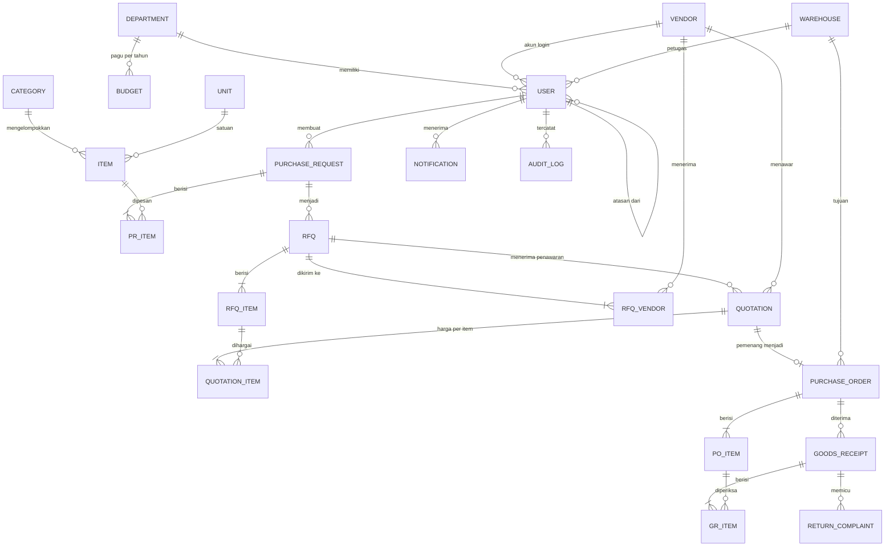

# ER Diagram (ringkas)

```mermaid
erDiagram
    DEPARTMENT ||--o{ USER : memiliki
    DEPARTMENT ||--o{ BUDGET : "pagu per tahun"
    USER ||--o{ USER : "atasan dari"
    VENDOR ||--o{ USER : "akun login"
    WAREHOUSE ||--o{ USER : "petugas"
    CATEGORY ||--o{ ITEM : mengelompokkan
    UNIT ||--o{ ITEM : satuan
    USER ||--o{ PURCHASE_REQUEST : membuat
    PURCHASE_REQUEST ||--|{ PR_ITEM : berisi
    ITEM ||--o{ PR_ITEM : dipesan
    PURCHASE_REQUEST ||--o{ RFQ : "menjadi"
    RFQ ||--|{ RFQ_ITEM : berisi
    RFQ ||--|{ RFQ_VENDOR : "dikirim ke"
    VENDOR ||--o{ RFQ_VENDOR : menerima
    RFQ ||--o{ QUOTATION : "menerima penawaran"
    VENDOR ||--o{ QUOTATION : menawar
    QUOTATION ||--|{ QUOTATION_ITEM : "harga per item"
    RFQ_ITEM ||--o{ QUOTATION_ITEM : dihargai
    QUOTATION ||--o| PURCHASE_ORDER : "pemenang menjadi"
    PURCHASE_ORDER ||--|{ PO_ITEM : berisi
    WAREHOUSE ||--o{ PURCHASE_ORDER : tujuan
    PURCHASE_ORDER ||--o{ GOODS_RECEIPT : diterima
    GOODS_RECEIPT ||--|{ GR_ITEM : berisi
    PO_ITEM ||--o{ GR_ITEM : diperiksa
    GOODS_RECEIPT ||--o{ RETURN_COMPLAINT : "memicu"
    USER ||--o{ NOTIFICATION : menerima
    USER ||--o{ AUDIT_LOG : "tercatat"
```

Tabel pendukung tanpa relasi langsung: `approval_logs` (doc_type PR/PO + doc_id), `document_sequences` (penomoran per jenis per bulan).
